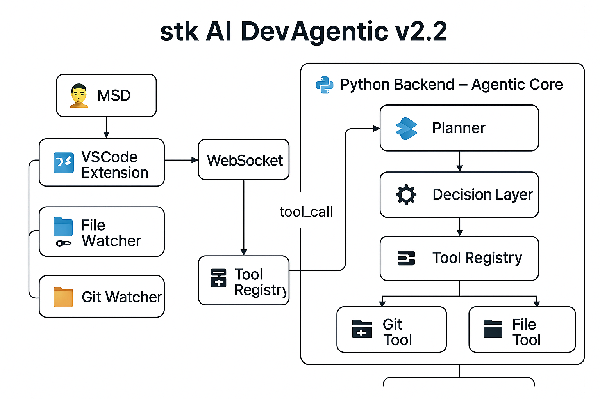

# 🤖 AI DevAgentic — v2.2

Agentic AI agent para desenvolvedores, com suporte inicial para VSCode e backend Core.  
Comportamento proativo, linguagem natural, uso de ferramentas e percepção do ambiente.

---

## ✨ Funcionalidades principais

🧠 Planejamento baseado em linguagem natural  
🔁 FSM e Decision Layer para estados de raciocínio e execução  
🧩 Tool Registry com execução via LLM Tool-Calling  
🖥️ Extensão WebSocket para VSCode com chat em tempo real  
📁 Watchers de arquivos e Git integrados ao ciclo do agente  
🔧 Ferramentas internas: Git Tool, File Tool, Terminal Tool  
🧠 Memória de contexto local

---

## 🧭 Arquitetura Visual (v2.2)



---

## 🗂️ Legenda do Diagrama

| Ícone / Bloco             | Descrição                                                                 |
|---------------------------|---------------------------------------------------------------------------|
| 🧑 MSD                    | Pessoa desenvolvedora interagindo com o VSCode e gerando eventos          |
| 🧩 VSCode Extension       | Extensão instalada no VSCode, com WebSocket e chat webview                |
| 📁 File Watcher           | Observador de arquivos (criação, edição, remoção)                         |
| 📂 Git Watcher            | Observador de mudanças no repositório Git                                 |
| 🔌 WebSocket              | Canal bidirecional entre extensão e backend Python                        |
| 🧰 Tool Registry (extensão)| Responsável por registrar sugestões de comandos e ferramentas              |
| 🐍 Python Backend         | Núcleo inteligente executando orquestração, decisão e ferramentas         |
| 📈 Planner                | Planejador de ações com base no input do usuário                          |
| ⚙️ Decision Layer         | Componente que decide se usará ferramentas ou LLM puro                    |
| 📚 Tool Registry (backend)| Registro interno das ferramentas executáveis                              |
| 🗃️ Git Tool               | Tool concreta que executa git status, git diff, etc                    |
| 📂 File Tool              | Tool para listar, ler ou inspecionar arquivos                            |

---

## 📂 Estrutura do Projeto
```
backend/
├── agent/                  # Planner, Orchestrator, FSM
├── actions/                # Implementação de ações
├── events/                 # Observadores de eventos (Git, arquivos, terminal)
├── interfaces/             # Interface LLM e OpenAI client
├── memory/                 # Memória de contexto
├── tools/                  # Registro e execução de ferramentas (Tool-Calling)
├── utils/                  # Utilitários diversos
├── server/                 # WebSocket API
├── main.py                 # Ponto de entrada
vscode_extension/           # Extensão integrada com o VSCode
```
---

## ⚙️ Requisitos

Python 3.10+  
Node.js (para extensão VSCode)  
openai (Python SDK)  
Variável de ambiente OPENAI_API_KEY  

---

## 🚀 Como rodar

### Backend
```bash
uvicorn backend.main:app --reload
```
### Extensão VSCode

1. Abra vscode_extension no VSCode  
2. Pressione F5 para iniciar a extensão em modo dev  
3. Execute o comando Iniciar AI DevAgentic  

---

## 💬 Exemplos de comandos no chat

| Entrada do usuário                         | Ação executada                            |
|--------------------------------------------|-------------------------------------------|
| qual o status do git?                    | Tool: get_git_status()                  |
| mostre a diferença entre os arquivos     | Tool: get_git_diff()                    |
| execute o comando ls                     | Tool: run_terminal_command("ls")        |
| liste os arquivos do projeto             | Tool: list_project_files()              |
| explique esse código: + código           | LLM puro (sem tools)                      |

---

## 🤝 Contribuindo

Crie uma issue com sugestões ou bugs  
Envie PRs com novos watchers, FSMs, planners ou tools!  
Toda colaboração é bem-vinda 🙌  

---

## 📘 Licença

MIT — © 2025 AI DevAgentic.
