# 📦 STK AI DevAgentic - v2.1 (Tool-Calling + Agentic AI)

> Agente de desenvolvimento inteligente no VSCode com backend Python, FSM, decisões automáticas e agora com LLM tool-calling via OpenAI.

---

## 🚀 Novidades na v2.1

✅ Suporte completo a **LLM Tool-Calling** 
✅ Tools registradas: get_git_status, get_git_diff, run_terminal_command, list_project_files 
✅ Camada de decisão agora conversa com o LLM que escolhe qual tool executar 
✅ Arquitetura agentic mantida com FSM, event listeners e camada de ação 

---

## 📊 Arquitetura Atualizada (Mermaid)

```mermaid
graph TD
    Client["VSCode Client 👨‍💻"]
    ChatWebview["Chat Webview 💬"]
    TerminalListener["Terminal Event Listener 🖥️"]
    FileWatcher["File Watcher 📂"]
    GitWatcher["Git Watcher 🔀"]

    Backend["Python Backend - Agentic Core 🧠"]
    WebSocketServer["WebSocket Server 🔌"]
    FSM["FSM - Finite State Machine 🔁"]
    DecisionLayer["Decision Layer 🧭"]
    OpenAIClient["LLM Client (Tool Calling) 🤖"]
    ToolRegistry["Tool Registry 🧰"]
    GitActions["Git Actions 🔀"]
    TerminalActions["Terminal Actions 💻"]
    FileActions["File Actions 📁"]
    ContextManager["Context Manager 📋"]

    Client --> ChatWebview
    ChatWebview -->|WebSocket| WebSocketServer

    TerminalListener -->|event| WebSocketServer
    FileWatcher -->|event| WebSocketServer
    GitWatcher -->|event| WebSocketServer

    WebSocketServer --> FSM
    FSM --> DecisionLayer
    DecisionLayer --> OpenAIClient
    OpenAIClient -->|function_call| ToolRegistry

    ToolRegistry --> GitActions
    ToolRegistry --> TerminalActions
    ToolRegistry --> FileActions

    DecisionLayer --> ContextManager
```

