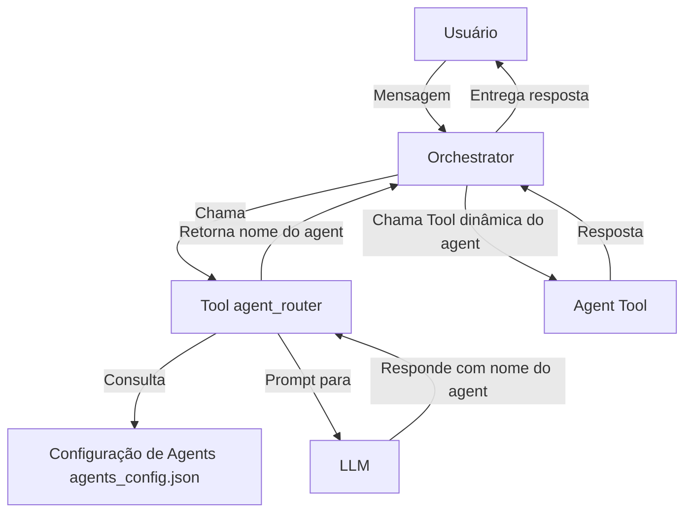

# 📘 Documentação Técnica: Agent Routing Flow

## 🔍 Visão Geral

O **Agent Routing Flow** é responsável por direcionar, de forma inteligente e automática, as solicitações dos usuários para o agente mais apropriado, conforme o contexto e o tipo de consulta. Isso garante que cada query seja tratada por um especialista, maximizando a **relevância e assertividade** das respostas do LLM (Large Language Model).

---

## 🧱 Arquitetura Geral



---

## 🧩 Componentes Principais

### 1. Orchestrator (`backend/agent/orchestrator.py`)
- Recebe a solicitação do usuário e inicia o fluxo de roteamento.
- Sempre utiliza a tool `agent_router` para decidir qual agent será chamado.
- Após a decisão, chama a **tool dinâmica** do agent escolhido.

### 2. Tool agent_router (`backend/tools/agent_router.py`)
- Implementa a lógica de roteamento.
- Recebe:
  - `input_text`: Texto do usuário.
  - `master_agent`: Nome do agente master.
  - `child_agents`: Lista de agentes filhos disponíveis.
- Monta um prompt contextualizado (incluindo o `system_prompt` do master).
- Usa o LLM para retornar o nome do agent mais adequado em JSON.

### 3. Definições de Agents (`backend/tools/agents_config.json`)
- Contém templates, descrições e prompts de sistema dos agentes disponíveis.

### 4. Loader de Agents Dinâmicos (`backend/tools/dynamic_agents_loader.py`)
- Carrega os agents do JSON e registra como ferramentas dinâmicas.
- Permite inclusão de novos agents sem alterar o core.

### 5. Tool Dinâmica do Agent
- Cada agent é uma tool registrada.
- Recebe a entrada do usuário e responde com seu próprio `system_prompt`.

---

## 🔁 Fluxo Detalhado

### 📥 Recepção da Solicitação
- O usuário envia uma mensagem via interface (IDE/web).
- O Orchestrator é ativado com a mensagem e contexto (master agent e agents filhos).

### 🚦 Roteamento com agent_router
1. O Orchestrator chama `agent_router`, passando:
   - Texto do usuário
   - `master_agent`
   - `child_agents`
2. O prompt enviado ao LLM inclui:
   - `system_prompt` do master
   - Lista e descrição dos agents filhos
   - A query do usuário
3. O LLM responde em JSON:
```json
{"agent": "nome_do_agent"}
```

### ⚙️ Execução do Agent Selecionado
- O Orchestrator chama a tool do agent indicado.
- O agent responde com base no seu próprio `system_prompt`.

### 📤 Resposta ao Usuário
- O Orchestrator retorna a resposta ao usuário final.

### ❗Fallback
- Se `agent_router` retornar `"none"`, o sistema notifica o usuário e pode solicitar feedback ou sugerir próximos passos.

---

## 📦 Extensibilidade

- **Adicionar novos agents:** basta editar o `agents_config.json`.
- **Novos tipos de Knowledge Source:** possível via metadados e lógica no `agent_router`.
- **Prompt modular:** flexível para novos contextos, exemplos ou instruções.

---

## 🗣️ Feedback de Usuário

- Após cada resposta, o usuário pode:
  - Reportar se a resposta foi útil
  - Sugerir melhorias
- Feedbacks são armazenados para ajustes futuros.

---

## 💬 Exemplo de Prompt do agent_router

```
Você é um Tech Lead. Avalie arquitetura, boas práticas e impacto de mudanças no projeto.

Como agente master 'tech_lead_agent', sua tarefa é escolher o melhor agente filho para responder ao usuário.

Usuário: preciso de um especialista em produto

Agentes filhos disponíveis:
- code_agent: Especialista em engenharia de software para revisão e melhoria de código.
- qa_agent: Engenheiro de qualidade com foco em testes e confiabilidade.
- pm_agent: Product Manager com visão de negócio e produto.

Responda apenas com o nome do agente filho em JSON, por exemplo: {"agent": "qa_agent"}.

Se não souber, responda {"agent": "none"}.
```

---

## ✅ Boas Práticas & Considerações Técnicas

- ✅ Parsing seguro do JSON retornado pelo LLM (limpar blocos markdown).
- ✅ Validação de nomes dos agents.
- ✅ Separação clara de responsabilidades.
- ✅ Observabilidade: logs dos prompts, respostas, agente escolhido e feedbacks.
- ✅ Testes automáticos: cobertura de pelo menos 90% dos casos.

---

## 💻 Exemplo de Chamada (Pseudo-código)

```python
# Orchestrator
args = {
  "input_text": user_input,
  "master_agent": master_agent["name"],
  "child_agents": [agent["name"] for agent in child_agents]
}
router_result = await call_tool_by_name("agent_router", args)
agent_name = json.loads(clean(router_result)).get("agent")
if not agent_name or agent_name == "none":
    # handle fallback
agent_result = await call_tool_by_name(agent_name, {"input": user_input})
return agent_result
```

---

## 🧩 Pontos de Integração com UI

- O usuário pode selecionar master e child agents.
- O envio da mensagem dispara o fluxo automaticamente.
- O feedback é coletado após a resposta.

---

## 📌 Requisitos Não-Funcionais

- ⏱️ **Performance:** seleção do agent < 2 segundos.
- 🔄 **Resiliência:** falhas comunicadas claramente ao usuário.
- 📋 **Auditabilidade:** logs de decisões e prompts disponíveis para troubleshooting.

---

## 🏁 Conclusão

Este fluxo garante:

- ✅ Modularidade e extensibilidade para novos agentes.
- ✅ Clareza e facilidade de manutenção.
- ✅ Respostas contextualizadas, maximizando a satisfação do usuário.

---

Se precisar de exemplos de código mais detalhados, diagramas de sequência ou sugestões de testes automatizados, estou à disposição!
